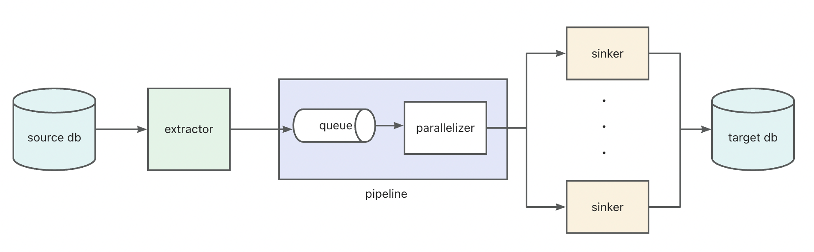

# English | [中文](README_ZH.md)

# Introduction

- ape-dts is a data migration tool aimed for any-to-any data migration.
- It is lightweight and does not rely on third-party components or additional storage.
- It uses Rust.


## Tasks supported

|  | mysql -> mysql | pg -> pg | mongo -> mongo | redis -> redis |
| :-------- | :-------- | :-------- | :-------- | :-------- |
|  Snapshot | &#10004; | &#10004; | &#10004; | &#10004; |
| CDC | &#10004; | &#10004; | &#10004; | &#10004; |
| Data check/revise/review | &#10004; | &#10004; | &#10004; | |
| Structure migration/check | &#10004; | &#10004; |  |  |


# Quick start

## Run demo in docker

Task configurations are in ini format. For more details, refer to [config details](./docs/english/config.md), [snapshot migration](./docs/english/snapshot/migration.md) and [CDC data sync](./docs/english/cdc/migration.md).

```
docker run -it \
--entrypoint sh \
-v [absolute-path]/task_config.ini:/task_config.ini \
apecloud/ape-dts:0.1.13.hotfix4 \
-c "/ape-dts /task_config.ini"
```

## Run tests

Refer to [docs](./dt-tests/README.md) for more details.

# More docs
- Configurations
    - [config details](./docs/english/config.md)
- Snapshot tasks
    - [migration](./docs/english/snapshot/migration.md)
    - [check](./docs/english/snapshot/check.md)
    - [revise](./docs/english/snapshot/revise.md)
    - [review](./docs/english/snapshot/review.md)
- CDC tasks
    - [data sync](./docs/english/cdc/migration.md)
    - [heartbeat](./docs/english/cdc/heartbeat.md)
    - [two-way data sync](./docs/english/cdc/two_way.md)

# Contributions

## Structure



## Modules
- dt-main: program entry
- dt-connector: extractors + sinkers for databases
- dt-pipeline: pipeline to connect extractors and sinkers
- dt-parallelizer: various parallel algorithms
- dt-task: create extractors + sinkers + pipelines + parallelizers according to configurations
- dt-meta: metadata management and basic data structures
- dt-common: common utils
- dt-tests: integration tests

## Coding

```
cargo build
cargo clippy --workspace
```

## Build docker image

- arm64
```
docker buildx build \
--platform linux/arm64 --tag ape-dts:0.1.0-test-arm64 \
--build-arg MODULE_NAME=dt-main --load . 
```

- amd64
```
docker buildx build \
--platform linux/amd64 --tag ape-dts:0.1.0-test-amd64 \
--build-arg MODULE_NAME=dt-main --load . 
```

# Contact me

<div align=center>

</div>