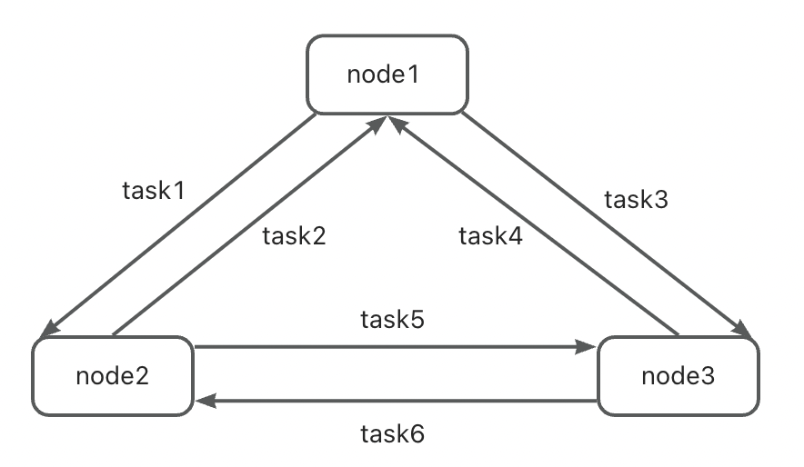

# 简介

在分布式架构中，源库和目标库不一定是简单的主备关系，有时它们能各自独立接受数据变更，但同时又需要在源和目标间进行数据同步，以确保它们都具有完整数据。

此时，我们除了要配置 “源 -> 目标” 的增量任务外，还需要配置 “目标 -> 源” 的任务，以实现双向数据同步。

# 数据循环

双向同步的主要难点是避免数据的循环复制，通常需要考虑如下场景：

- MySQL 源端插入了一条数据 a，增量任务 “源 -> 目标” 从源端解析到 binlog，并同步到 MySQL 目标端。
- MySQL 目标端插入数据 a 后，也产生了一条 binlog。
- 增量任务 “目标 -> 源” 从目标端拉取到该条插入 a 数据的 binlog，并再次同步到源端。

# 拓扑概念

实际上，双向甚至网状的数据同步都可以抽象成拓扑：

- 需要互相同步的数据库构成一个逻辑集群，每个数据库为一个节点（node）。
- 用一个或多个同步任务来串联这些数据库，每个任务即为一条边（side），数据在这些节点间同步。
- 拓扑 = 数据库节点 + 任务。

## 拓扑示例

<div align=center>

<br/>
双向拓扑
</div>

***

<div align=center>

<br/>
网状拓扑
</div>

***

<div align=center>

<br/>
星状拓扑
</div>

***

# 数据打标

我们采用**数据打标**的方式来避免循环复制。

## 打标原理

假设在一个 MySQL 的双向拓扑中，有两个任务：

- task1（源：node1，目标：node2）；
- task2（源：node2，目标：node1）。

task1 在将数据写入 node2 时，会将数据的**原始来源**通过打标表产生标识，记录到 node2 的 binlog 中。

task2 从 node2 中解析 binlog 时，识别到某些 binlog 是由 task1 的写入产生的，且其数据的原始来源是 node1，因此放弃将这些数据同步到 node1，以避免循环复制。

## data marker 表

为了对增量数据进行打标，需要目标库提供额外的打标表（marker）。打标信息实际上就是通过更新 marker 的方式写入 binlog（mysql）/ wal（pg）/ aof（redis）的。

打标表名可由用户自行指定，但在一个拓扑中，所有节点上的打标表必须一致。

用户可预先建立打标表，如果指定了 marker 却没有预建表，CDC 任务会尝试建表，但这需要 sinker 使用的账户有相应权限。

### MySQL

```
CREATE TABLE IF NOT EXISTS `{}`.`{}` (
    data_origin_node varchar(255) NOT NULL,
    src_node varchar(255) NOT NULL,
    dst_node varchar(255) NOT NULL,
    n bigint DEFAULT NULL,
    PRIMARY KEY (data_origin_node, src_node, dst_node)
)
```

### PG

```
CREATE TABLE IF NOT EXISTS "{}"."{}" (
    data_origin_node varchar(255) NOT NULL,
    src_node varchar(255) NOT NULL,
    dst_node varchar(255) NOT NULL,
    n bigint DEFAULT NULL,
    PRIMARY KEY (data_origin_node, src_node, dst_node)
)
```

### Redis

Redis 的打标信息通过更新 Redis key 的方式写入目标端 aof，不需要预建 key。


# 任务配置

与普通的增量任务相比，还需要添加 [data_marker] 配置。

```
[data_marker]
topo_name=topo1
topo_nodes=node1,node2
src_node=node1
dst_node=node2
do_nodes=node1
ignore_nodes=node2
marker=ape_trans_mysql.topo1
```

- topo_name：拓扑名，由用户指定，所有任务的拓扑名需保持一致。
- topo_nodes：拓扑包含的节点名，由用户指定，所有任务的节点名需保持一致。此字段为保留字段，暂未被使用。
- src_node：当前任务的源节点。
- dst_node：当前任务的目标节点。
- do_nodes：如果数据标识显示其来源于这些节点，当前任务会将其同步到目标。
- ignore_nodes：如果数据标识显示其来源于这些节点，当前任务会将其丢弃。
- marker：数据打标表，所有节点上的打标表需保持一致。


# 示例: MySQL_to_MySQL

下面以拓扑中包含两个节点（node1，node2）的双向同步为例。

## node1 -> node2
```
[data_marker]
topo_name=topo1
topo_nodes=node1,node2
src_node=node1
dst_node=node2
do_nodes=node1
ignore_nodes=node2
marker=ape_trans_mysql.topo1
```

## node2 -> node1
```
[data_marker]
topo_name=topo1
topo_nodes=node1,node2
src_node=node2
dst_node=node1
do_nodes=node2
ignore_nodes=node1
marker=ape_trans_mysql.topo1
```

# 网状同步

基于 **data marker** 和 **双向同步**，还可以进一步做网状同步。

如拓扑中有 3 个节点，可以配置 3 个任务实现相互同步，从而保证任一个节点的数据变更，都能在其他节点正确重放。

# 其他配置参考

参考各类型集成测试中 cycle 相关用例的 task_config.ini：
    - dt-tests/tests/mysql_to_mysql/cdc
    - dt-tests/tests/pg_to_pg/cdc
    - dt-tests/tests/redis_to_redis/cdc