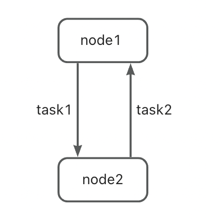
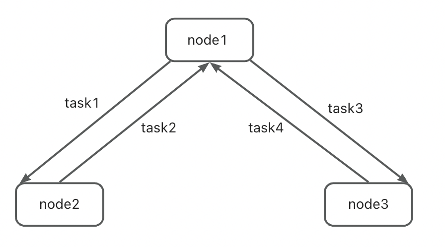

# Introduction

In a distributed system, the source and target databases may not necessarily have a simple master-slave relationship. Sometimes they can independently accept data changes, but data sync is still needed to ensure that they both have complete data.

To enable two-way data sync, we need to configure CDC tasks for both "source -> target" and "target -> source" directions.

# Cyclic replication

The main challenge for two-way data sync is to avoid data cyclic replication. Considering the following scenario:

- A record "a" is inserted into the source MySQL database, and the CDC task "source -> target" parses this change from the source's binlog and syncs it into the target.
- A binlog record for inserting "a" is generated in the target MySQL.
- CDC task "target -> source" pulls the binlog entry for inserting record "a", and syncs it to source.

# Topology

In fact, two-way or even net data sync can be considered as a topology:

- Databases that need to be synced with each other form a logical cluster, and each database is a node.
- One or more data sync tasks are used to connect these databases, and each task is a side. Data is synced between these nodes.
- Topology = database nodes + tasks.

## Examples

<div align=center>

<br/>
Two-Way Topology
</div>

***

<div align=center>

<br/>
Net Topology
</div>

***

<div align=center>

<br/>
Star Topology
</div>

***

# Data marking

We use data marker to avoid cyclic replication.

## Principles

Assume that in a MySQL two-way topology, there are two tasks:

- task1 (source: node1, target: node2).
- task2 (source: node2, target: node1).

When task1 writes data to node2, it generates a marker that identifies the original source of the data. This marker is recorded in the binlog of node2.

When task2 parses the binlog from node2, it finds out that some binlogs are generated by task1, and the original source of the data is node1, so it gives up these data to avoid cyclic data sync.

## Marker table

In order to mark CDC data, the target database needs an additional marker table. The marker info is actually written to binlog(mysql) /wal(pg) / aof(redis) by updating the marker table.

If data marker is configured with no table created, CDC tasks will try to create it. So, the sinker account needs to have corresponding permissions.

### MySQL
```
CREATE TABLE IF NOT EXISTS `{}`.`{}` (
    data_origin_node varchar(255) NOT NULL,
    src_node varchar(255) NOT NULL,
    dst_node varchar(255) NOT NULL,
    n bigint DEFAULT NULL,
    PRIMARY KEY (data_origin_node, src_node, dst_node)
)
```

### PG
```
CREATE TABLE IF NOT EXISTS "{}"."{}" (
    data_origin_node varchar(255) NOT NULL,
    src_node varchar(255) NOT NULL,
    dst_node varchar(255) NOT NULL,
    n bigint DEFAULT NULL,
    PRIMARY KEY (data_origin_node, src_node, dst_node)
)
```

### Redis

The Redis marker info is written to the target aof by updating the Redis key. No need to pre-create anything.


# Configurations

In addition to the regular configurations, you also need to add the [data_marker] configuration.

```
[data_marker]
topo_name=topo1
topo_nodes=node1,node2
src_node=node1
dst_node=node2
do_nodes=node1
ignore_nodes=node2
marker=ape_trans_mysql.topo1
```

- topo_name: the name of topology, defined by the user. It should be consistent across all tasks within the topology.
- topo_nodes: node names in topology, defined by the user. It should be consistent across all tasks within the topology. This field is reserved and has not been used yet.
- src_node: source node of the current task.
- dst_node: target node of the current task.
- do_nodes: If the data is originated from these nodes, the task will sync it to the target.
- ignore_nodes: If the data is originated from these nodes, the task will ignore it.
- marker: data marker table, defined by the user. It should be consistent across all tasks within the topology.


# Example: MySQL_to_MySQL

Here is an example for two-way data sync.

## node1 -> node2
```
[data_marker]
topo_name=topo1
topo_nodes=node1,node2
src_node=node1
dst_node=node2
do_nodes=node1
ignore_nodes=node2
marker=ape_trans_mysql.topo1
```

## node2 -> node1
```
[data_marker]
topo_name=topo1
topo_nodes=node1,node2
src_node=node2
dst_node=node1
do_nodes=node2
ignore_nodes=node1
marker=ape_trans_mysql.topo1
```

# Other configurations

Refer to task_config.ini in cycle-related tests:
- dt-tests/tests/mysql_to_mysql/cdc
- dt-tests/tests/pg_to_pg/cdc
- dt-tests/tests/redis_to_redis/cdc